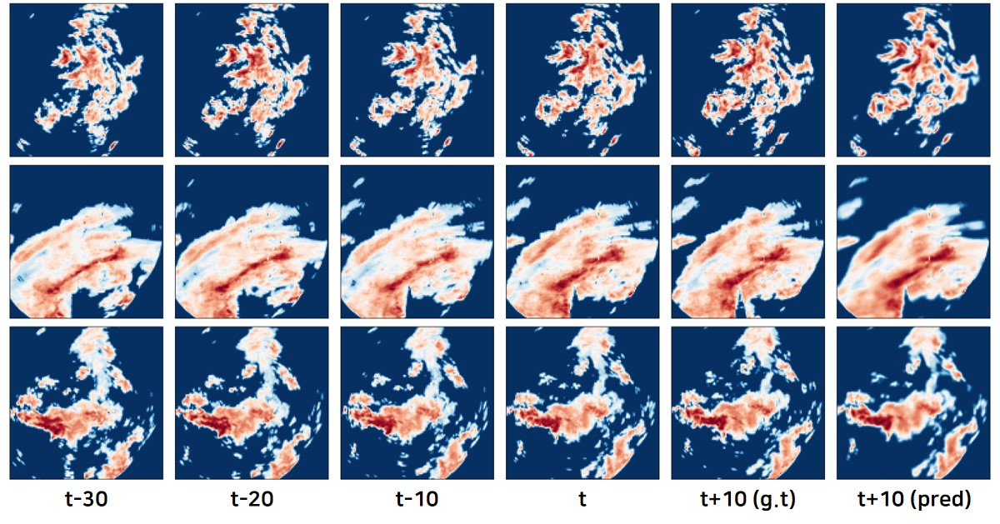

# 공공데이터 활용 수력 댐 강우예측 AI 경진대회, 한국수력원자력(주) & Dacon
- **대회 기간**: 2020년 10월 05일 ~ 2020년 11월 13일 18시
- **참여 일자**: 2020년 11월 01일 (D-11)
- **대회 링크**: [공공데이터 활용 수력 댐 강우예측 AI 경진대회](https://dacon.io/competitions/official/235646/overview/)
- **대회 결과**: Private ranking - 29등 / 131명 (상위  22.14%)
- **결과 예시 사진:**

 

---

## Solution
### Main Ideas
- 이번 대회 문제는 image 4개를 입력 받아서 image 하나를 출력하는 문제였습니다. 이런 문제는 인코더-디코더 구조의 모델로 해결 할 수 있는데, 저는 그 중 가장 널리 사용되는 UNet을 사용하였습니다.
- 120 x 120 이미지에 UNet을 적용할 경우 10 에폭 전에 오버피팅이 발생합니다. 이미지의 각 픽셀이 고유한 위치 좌표를 의미한다는 점과 과한 Augmentation은 오히려 자연법칙을 훼손할 수 있다는 점을 고려하여 `Blur`, `Median Blur`, `CutOut`만 사용하였습니다.
이 때 Input에만 Augmentation을 적용하여, 노이지한 이미지를 입력받아도 정상적인 출력을 할 수 있는 모델을 만들었습니다.

- MSE와 MAE는 이미지 안의 모든 픽셀들을 독립이라고 가정합니다. 이러한 가정 때문에 MSE/MAE를 사용할 경우 Blur한 이미지가 생성되게 됩니다. MSE/MAE 대신 두 이미지 사이의 휘도, 명암, 구조를 비교하는  `SSIM` 이라는 손실함수를 사용했습니다. 아래는 두 손실함수를 사용한 모델이 충분히 학습을 마친 후 예측한 결과입니다.
  

### Level 1 Model
- UNet from [@milesial](https://github.com/milesial/Pytorch-UNet/blob/master/unet/unet_model.py#L8) 
  with `n_channels=4` and `n_classes=1`
- Loss function: MSE / MAE / SSIM
- Optimizer: [AdamW](https://arxiv.org/abs/1711.05101)
- Scheduler: ReduceLROnPlateau
- Augmentation: Blur, Median Blur, CutOut 

### Level 2 Model (Averaging folds ensemble)
- 데이터를 5개의 폴드로 분할하고 다양한 실험 환경에서 모델을 학습시켜 얻은 결과들을 trial-and-error 방식으로 선택하여 평균  
    
| Loss  | Augmentations | Fold | LB     |
| ---   | ---           | ---  | ---    |
| MAE   | O             | 0    | 0.5505
| MSE   | X             | 0    | 0.5516 |
| MSE   | O             | 1    | 0.5564 |
| SSIM  | X             | 0    | 0.5595 |
| SSIM  | O             | 0    | **0.5491** | 
| SSIM  | O             | 1    | 0.5557 |      

---
## How to explore the codes?
### 0. unet, pytorch_ssim 폴더
- UNet과 SSIM의 구현체입니다. 직접 구현한 것은 아니고 각각 [@milesial](https://github.com/milesial/Pytorch-UNet/blob/master/unet/unet_model.py#L8) 와 
[@Po-Hsun-Su](https://github.com/Po-Hsun-Su/pytorch-ssim/blob/master/pytorch_ssim/__init__.py#L39) 의 코드를 복사 및 붙여넣기 하였습니다.
### 1. preprocess.py
- `torch.utils.data.DataSet`에 사용하기 위한 데이터 전처리를 담은 코드입니다. 각 데이터의 `file_name`과 `fold_number`를 열로 갖는 `metadata.csv` 파일을 생성합니다. 
- 실행 예시 
    - 다운 받은 train 폴더와 test 데이터가 있는 폴더를 `--dir_input` 인자로 넘겨주어야 합니다.
~~~
python preprocess.py --dir_input ./input --dir_metadata ./input/metadata.csv
~~~

### 2. datasets.py
- `torch.utils.data.DataSet`을 상속받는 Class가 정의되어 있는 코드입니다. 나중에 `torch.utils.data.DataLoader`에 사용됩니다.
- 대회에 사용되지는 않았지만 `CutMix`와 `MixUP` 코드도 포함되어 있습니다. 그 외 augmentation 기법은 `transforms.py`에 정의되어 있습니다.

### 3. fitter.py
- 모델과 `torch.utils.data.DataLoader`를 입력 받아서 모델의 학습, 검증, 그리고 예측하는 Class가 정의되어 있습니다.

### 4. train.py, predict.py, ensemble.py
- 위 코드들을 임포트하여 실제 모델을 학습 및 검증하고 예측하는 프로그램을 실행 스크립트입니다. 즉,
    - 여러가지 하이퍼파라미터 입력 받고
    - 메타데이터를 불러와 `torch.utils.data.DataSet`와 `torch.utils.data.DataLoader`를 정의하며
    - 모델을 학습 및 검증, 그리고 예측하는 과정을 수행합니다. 
    - 마지막으로 다양한 예측 submission 파일을 평균하여 최종 결과물을 산출합니다.
- 여러가지 하이퍼파라미터를 바꿔가면서 스크립트를 실행하여 효율적인 실험을 할 수 있습니다. 
- 실행 예시
~~~
python train.py --dir_meta ./input/metadata.csv --batch_size 32 --p_cutmix 0.00 --p_mixup 0.00 --lr 0.005 --n_epochs 30 --verbose True --dir_base ./output/checkpoints
python predict.py --dir_meta ./input/metadata.csv --batch_size 1 --dir_checkpoint ./output/checkpoints/last-checkpoint.bin --dir_sub ./output/sub/sample_submission.csv
python ensemble.py --dir_sample_submission ./output/sub/sample_submission.csv --dir_subs ./output/sub/to_ensemble --dir_result_sub ./output/sub/ensemble.csv
~~~ 
 
